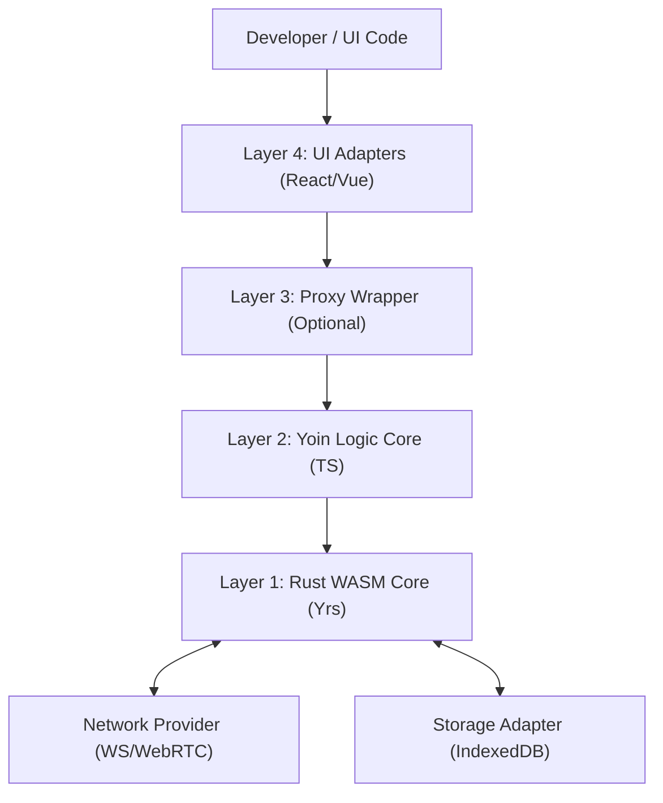

# Architecture: Yoin Sync Engine

本文檔定義了 **Yoin** 的架構設計、通訊協議以及未來的發展藍圖。Yoin 是一個追求「極致效能」與「顆粒度控制」的分散式協作引擎，底層由 Rust (Yrs) 驅動。

---

## 1. 架構全景 (System Overview)

Yoin 採用分層架構，確保底層引擎的純粹性，同時透過可選的抽象層提供開發者體驗（DX）。

---

## 2. 核心分層設計 (Layer Definitions)

### Layer 1: Rust WASM Core (Current)

* **核心技術：** 基於 `yrs` (Rust 版 CRDT)。
* **責任：** 處理二進制 Update、合併衝突、維護 State Vector。
* **關鍵優勢：** 比純 JS 實現更低的記憶體佔用與更快的運算速度（在萬級數據下尤為明顯）。

### Layer 2: Logic Core / YoinClient (Current)

* **責任：** * **通訊協議：** 實作 `MSG_SYNC_STEP` 三階段握手協議。
* **同步策略：** 差異化更新（Delta Updates）廣播。
* **離線持久化：** 整合 IndexedDB，實作防抖（Debounced）存檔。
* **Awareness：** 實作 Heartbeat 與 GC 機制，追蹤在線使用者狀態。

### Layer 3: Proxy Wrapper (Planned)

* **責任：** 提供「隱形同步」體驗。
* **技術細節：** 透過 JS Proxy 攔截寫入操作，自動追蹤路徑（Path Tracking）並映射至 `setMapDeep`。
* **價值：** 降低開發門檻，將數據操作簡化為普通 JavaScript 物件賦值。

### Layer 4: UI Adapters (Planned)

* **責任：** * **React:** 提供 `useYoin` Hook 並整合 `useSyncExternalStore`。
* **Vue:** 將 Yoin 狀態轉化為 `reactive` 響應式物件。

* **目標：** 實現數據變動時的局部 UI 更新（Fine-grained reactivity）。

---

## 3. 通訊協議 (Protocol Spec)

Yoin 使用 1-byte Header 來定義通訊封包類型：

| Header (Byte 0) | 類型 | 描述 |
| --- | --- | --- |
| `0x00` (0) | MSG_SYNC_STEP_1 | 客戶端發送自己的 State Vector。 |
| `0x01` (1) | MSG_SYNC_STEP_2 | 發送增量 Update 資料 (Delta)。 |
| `0x02` (2) | MSG_SYNC_STEP_1_REPLY | 伺服器回覆缺失的數據差額。 |
| `0x03` (3) | MSG_AWARENESS | 廣播游標、在線狀態 (JSON)。 |

---

## 4. 發展藍圖 (Roadmap & Backlog)

### 🚀 已實作 (Current Features)

* [x] **Rust WASM 引擎：** 整合 Yrs 核心功能。
* [x] **高效 Awareness 系統：** 具備防抖廣播與過期回收功能。
* [x] **雙層存檔機制：** 記憶體快照 + IndexedDB 異步存檔。
* [x] **深層路徑寫入：** 支援 `setMapDeep` 跨層級操作。

### 🛠️ 近期優化 (Short-term Backlog)

* [x] **Delta Update 返回值優化：** 讓所有寫入方法直接回傳 `Uint8Array` 以減少不必要的 snapshot 匯出。
* [x] **Undo / Redo Manager：** 在 Rust 端實作事務堆疊，並暴露 `undo/redo` 接口。
* [x] **Schema Validation：** 整合 Zod 驗證層，防止同步非法格式數據。

### 🌟 遠期目標 (Long-term Vision)

* [ ] **Proxy 透明代理：** 開發 `@yoin/proxy` 膠水層。
* [ ] **多框架支援：** 發佈 `@yoin/react` 與 `@yoin/vue` 套件。
* [ ] **增量存檔優化：** 實作「Snapshot + Update Log」的存檔結構，優化超大型文件讀取速度。
* [ ] **端到端加密 (E2EE)：** 在 Network Provider 層實作二進制流加密。

---

## 5. 設計哲學 (Design Decisions)

1. **效能優先：** 拒絕在核心層進行頻繁的 JSON 序列化，優先使用 Uint8Array。
2. **顆粒度控制：** 保持 `YoinClient` 的指令式 API，讓開發者能明確控制每一筆網路流量。
3. **模組化：** 各層級解耦，開發者可根據需求決定是否引入 Proxy 或特定的 UI Adapter。

---
