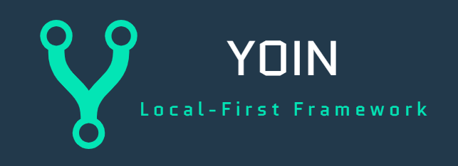

[繁體中文](README_zh_Hant.md) | [English](README.md)

# Yoin

**Local-First Real-time Collaborative State Synchronization Framework**

[](https://github.com/Saisai568/yoin/releases/tag/v0.1.0)
[](LICENSE)
[](packages/client/tests)
[](public/logo_1.png)

Yoin is a CRDT-based real-time collaboration framework that lets developers add multiplayer real-time sync to any application in just a few lines of code. The core engine is written in Rust and runs in the browser via WebAssembly, paired with Cloudflare Durable Objects for WebSocket relay — delivering low-latency, offline-capable, auto-merging collaborative experiences.

> **📦 Version 0.1.0** — First public release with production-ready stability fixes. See [CHANGELOG.md](CHANGELOG.md) for details.

## Features

- **CRDT Engine (Rust + WASM)** — Conflict-free merging powered by [Yrs](https://github.com/y-crdt/y-crdt); edits from any device converge automatically after going offline
- **TypeScript SDK** — YoinClient micro-kernel + Plugin system + Proxy transparent writes + React Hooks
- **Cloudflare Edge** — Durable Objects room isolation + Hibernation API with zero cold-start on-demand wake-up
- **Offline-First** — IndexedDB persistence + offline queue; full functionality while disconnected, auto-sync on reconnect
- **Awareness System** — Real-time cursors, presence status, selection broadcasting (rAF throttling + Ghost Busting)
- **Undo / Redo** — Only undoes your own operations without affecting remote collaborators
- **Schema Validation** — Integrated with Zod for automatic data structure validation on writes
- **Proxy Syntax** — Use native JS `obj.key = value` syntax to operate on CRDTs with deep nesting support

## Quick Start

### Installation

```bash
npm install @yoin/client @yoin/core
# or
pnpm add @yoin/client @yoin/core
```

### Basic Usage

```typescript
import { initYoin, YoinClient, createDbPlugin, createUndoPlugin } from '@yoin/client';

// 1. Initialize the WASM engine
await initYoin();

// 2. Create a client and connect to the Cloudflare Worker
const client = new YoinClient({
  url: 'wss://your-worker.workers.dev',
  docId: 'my-document',
});

// 3. Install plugins
const { plugin: dbPlugin } = createDbPlugin({ dbName: 'my-app' });
const { plugin: undoPlugin, undo, redo } = createUndoPlugin();
client.use(dbPlugin).use(undoPlugin);

// 4. Work with data - Text
client.insertText(0, 'Hello World');
console.log(client.getText()); // "Hello World"

// 5. Work with data - Map
client.setMap('settings', 'theme', 'dark');
client.setMapDeep('settings', ['nested', 'value'], 42);
console.log(client.getMap('settings')); // { theme: "dark", nested: { value: 42 } }

// 6. Work with data - Array
client.pushArray('logs', { action: 'login', time: Date.now() });
console.log(client.getArray('logs'));

// 7. Subscribe to changes
const unsubscribe = client.subscribe((text) => {
  document.getElementById('editor')!.textContent = text;
});

// 8. Cleanup
client.destroy();
```

### Proxy Transparent Writes

```typescript
import { createMapProxy, createArrayProxy } from '@yoin/client';

const settings = createMapProxy<{ theme: string; fontSize: number }>(client, 'settings');
settings.theme = 'dark';       // Automatically triggers CRDT write + network sync
settings.fontSize = 16;

const logs = createArrayProxy<string>(client, 'logs');
logs.push('user joined');      // Automatically triggers pushArray
```

### React Integration

```tsx
import { YoinProvider, useYoinMap, useYoinArray, useYoinAwareness } from '@yoin/client/react';

function App() {
  return (
    <YoinProvider client={client}>
      <SettingsPanel />
      <UserList />
    </YoinProvider>
  );
}

function SettingsPanel() {
  const settings = useYoinMap<{ theme: string }>('app-settings');
  return (
    <select value={settings.theme} onChange={e => settings.theme = e.target.value}>
      <option value="light">Light</option>
      <option value="dark">Dark</option>
    </select>
  );
}

function UserList() {
  const awareness = useYoinAwareness();
  return (
    <ul>
      {[...awareness.values()].map(user => (
        <li key={user.clientId} style={{ color: user.color }}>{user.name}</li>
      ))}
    </ul>
  );
}
```

## Project Structure

```
yoin/
├── packages/
│   ├── core/           # Rust CRDT engine → WebAssembly
│   │   ├── src/lib.rs  # YoinDoc: Text / Map / Array / Undo / Sync API
│   │   └── pkg-web/    # wasm-pack output (auto-generated)
│   └── client/         # @yoin/client TypeScript SDK
│       └── src/
│           ├── YoinClient.ts    # Micro-kernel: CRDT + networking + plugins
│           ├── network.ts       # WebSocket + offline queue + auto-reconnect
│           ├── storage.ts       # IndexedDB adapter
│           ├── proxy.ts         # Map / Array Proxy transparent writes
│           ├── plugin.ts        # Plugin interface definition
│           ├── plugins/db.ts    # IndexedDB persistence plugin
│           ├── plugins/undo.ts  # Undo / Redo plugin
│           ├── logger.ts        # Development debug logging plugin
│           ├── react/index.tsx  # React Hooks (Provider / useYoinMap / ...)
│           └── wasm/loader.ts   # WASM initializer
├── yoin-worker/        # Cloudflare Worker (Durable Objects WebSocket Relay)
├── apps/
│   ├── demo/           # Demo application (Vanilla JS + React)
│   └── api-test/       # Full-coverage API test runner (browser-based)
│       └── src/main.ts # Tests all SDK APIs: Init / YoinClient / Text / Map / Array / Awareness / Network / Plugins       
├── server/             # Node.js development server
├── docs/               # Technical docs
└── deploy.bat          # One-click full-stack deploy script
```

## Development Guide

### Prerequisites

- Node.js ≥ 18
- pnpm ≥ 9
- Rust toolchain + wasm-pack (for building Core)
- Cloudflare account (for deploying Worker / Pages)

### Common Commands

```bash
# Install dependencies
pnpm install

# Full build (WASM → SDK → Demo)
pnpm build

# Start Demo dev server
pnpm dev:demo

# Start API Test app dev server
pnpm dev:api-test

# Build API Test app
pnpm build:api-test

# Run tests
pnpm test            # Unit + integration tests
pnpm test:e2e        # Playwright E2E tests
pnpm test:coverage   # Coverage report

# Type checking
pnpm typecheck

# Full deploy
.\deploy.bat         # Windows
# Or deploy individually
pnpm deploy:worker   # Deploy Worker only
pnpm deploy:pages    # Build + deploy Pages
```

## Tech Stack

| Layer | Technology | Description |
|-------|-----------|-------------|
| CRDT Engine | Rust + Yrs + wasm-bindgen | Automatic conflict resolution, incremental diff sync |
| Client SDK | TypeScript + tsup | Micro-kernel architecture, dual-format output (ESM / CJS) |
| Backend Relay | Cloudflare Workers + Durable Objects | Hibernation API, on-demand wake-up |
| Frontend | React 19 / Vanilla JS | Hooks + Proxy integration |
| Build Tools | Vite 7 + wasm-pack + tsup | WASM support + HMR |
| Testing | Vitest + Playwright | Unit / E2E dual-track testing |
| Deployment | Cloudflare Pages + Workers | Global edge distribution |

## API Stability

Yoin follows [Semantic Versioning 2.0.0](https://semver.org/):

- **0.x versions (current):** API may include breaking changes between minor versions. Lock to patch versions:
  ```json
  "dependencies": {
    "@yoin/client": "~0.1.0"  // Only accept patch updates
  }
  ```

- **1.0.0 onwards:**
  - **MAJOR**: Incompatible API changes
  - **MINOR**: New backward-compatible features
  - **PATCH**: Backward-compatible bug fixes

### Currently Stable APIs
✅ `YoinClient` core methods  
✅ `createDbPlugin`, `createUndoPlugin`  
⚠️ `Awareness` API may change in 0.2.0  
⚠️ React Hooks signatures may evolve  

## Documentation

- 📖 [API Reference](docs/API.md) — Complete SDK documentation
- 🏛️ [Architecture Guide](docs/ARCHITECTURE.md) — System design and internals
- 👥 [Contributing Guide](docs/CONTRIBUTING.md) — Development workflow
- 📄 [Changelog](CHANGELOG.md) — Version history and migration guides

## Known Issues

- Browser compatibility not fully tested on Safari < 14 and mobile browsers
- Test coverage at 57% overall — `storage.ts` and `db.ts` plugins need additional tests
- No built-in telemetry or error tracking integration yet

See [GitHub Issues](https://github.com/Saisai568/yoin/issues) for the full list.

## Contributing

Contributions are welcome! Please read [CONTRIBUTING.md](docs/CONTRIBUTING.md) for guidelines.

## License

MIT License
